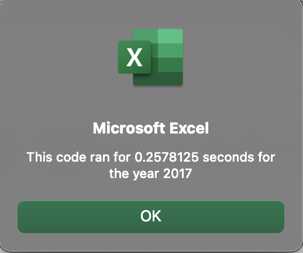
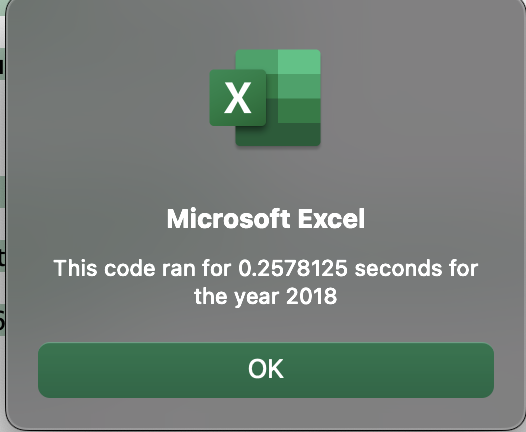
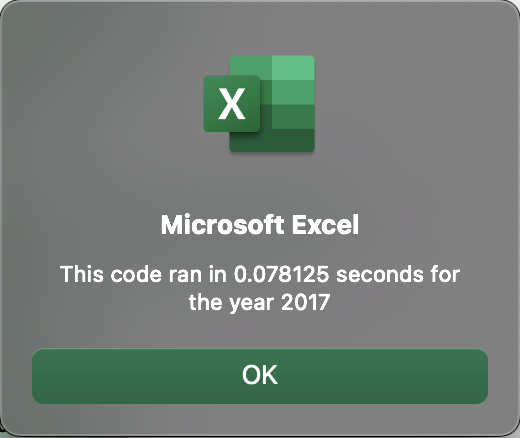
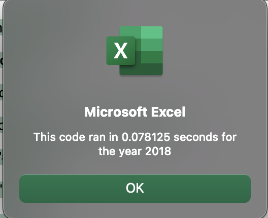
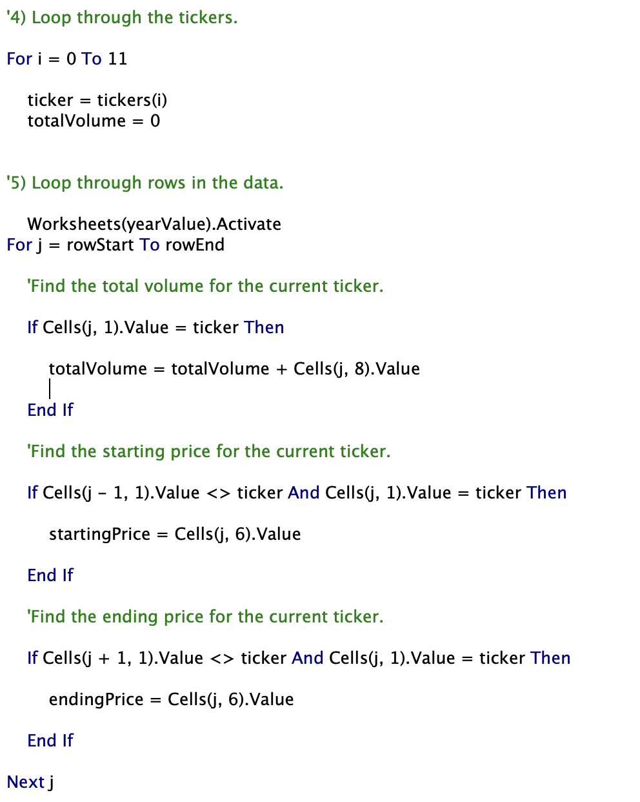
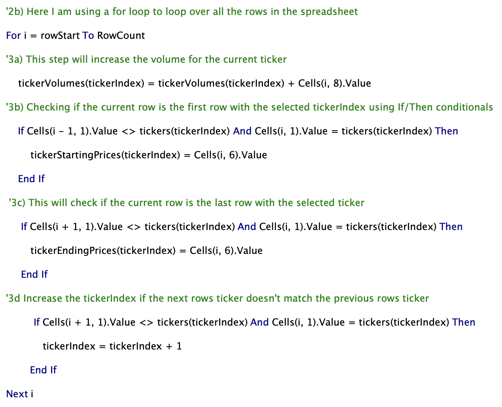

# Stock Analysis

## Overview of Project

In the initial part of this project, a VBA script was created to analyze stock data for twelve tickers, or companies, to measure their performance in the years 2017 and 2018. The analysis worked well and data was produced for each company, however, the same code could be applied to the entire stock market - with thousands of companies and exponentially more data points!

The issue with using our code on the entire stock market is that the run time (e.g the performance and efficiency) may be exhaustively long due to inefficiences in the unrefactored code. Therefore, in this challenge, arrays were used - these are variables that can store multiple values with the same data type. The code loops through all the data just one time to collect the same information as looping through the data set numerous times, but more efficiently to reduce the run time. 

The performance of the unrefactored vs. refactored code was measured via run time comparison. 

## Results

### Unrefactored vs. Refactored Code Run Time Comparisons 

This is the run time for the unrefactored analysis of data in the year 2017: 

This is the run time for the unrefactored analysis of data in the year 2018: 

This is the run time for the refactored analysis of data in the year 2017:  

This is the run time for the refactored analysis of data in the year 2018: 

As can be seen above, refactoring the code cuts down on run time by 0.25 seconds (250 milliseconds) each time it is run for both the years 2017 and 2018. 

### Unrefactored vs. Refactored Raw Code Comparison

This is the unrefactored code: 

This is the refactored code: 

As can be seen, arrays were used and the ticker index is increased if it doesn't match the previous rows ticker thereby looping through only a subset of the data rather than the whole thing again!

## Summary

### Advantages and Disadvantages of Refactoring Code

The advantages of refactoring code are to gain efficiences where they can be. By doing this, the code is improved and can be applied more broadly to larger data sets that would have been priorly too exhaustive to run. 

A disadvantage to refactoring code is that it obviously takes some time upfront to refactor and there is the potential that it might not work in the first place! 

### Advantages and Disadvantages of the Original and Refactored VBA Script

An advantage of the original script is that logically it makes sense and is easy to understand, especially for someone new to learning the VBA language. An advantage of the refactored VBA script is that it can be applied to the entire stock market! 

A disadvantage of the original script is its relatively poor performance compared to the refactored script. A disadvantage to the refactored script is that there was a lot of time debugging the code to ensure it worked properly in the first place. Deadlines may hamper refactoring if someone wants the code as soon as possible! 

